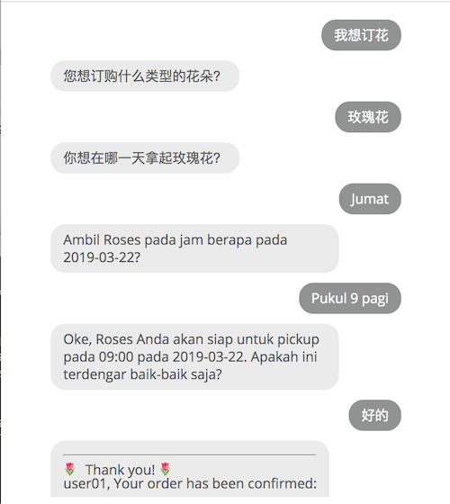

# Multilanguage Chatbot

The Multilanguage Lex Bot example demonstrates a pattern to enable AWS customers to configure multilanguage conversational bot experiences across the 21 languages supported by Amazon Translate, overcoming the current US English monolingual limitation of Amazon Lex. 

The solution deploys a tranlation layer in front of the example Order Flowers Amazon Lex bot. This simple pattern provides a way for Amazon Lex bots to converse in all 21 languages supported by Amazon Translate. 

## Design

 

The environment setup with the following Cloudformation templates:

* Identity Stack. Cognito UserPool and a test user. [cognito/cognito-cfn.yaml]()
* Multilanguage Bot Stack. API Gateway and Lambda function defined in a SAM template. [MultilanguageBot.yaml]()
* Edge Stack. S3 website with CloudFront distribution and Route 53 DNS hostname entry for the site [edge/cloudfront-website.yaml]()
* Pipeline Stack. Deploys [pipeline/pipeline.yaml]()
* Metrics: TODO

### User Experience

A sample [BotUI](https://botui.org/) user interface is provided. The following illustrates the bot contextually switching between 2 different languages in response to user input. In this example, the front-end switches between Chinese (Simplified) and Bahasa Indonesia, mediating with the Lex back-end which remains limited to US English. To users, the effect is the bot appears to be multilingual.

 

#### Cross-origin resource sharing (CORS)

A browser-side CORS security restriction arises if the browser needs to interact with an S3 website endpoint and an API Gateway, each with different endpoint endpoint domain names.

The approach used in this solution avoids this CORS problem by utilizing a single front hostname resolving to a CloudFront distribution that routes to the S3 website and the API Gateway "backend" endpoints. This way, the browser only connects into a single hostname. 

One alternative approach would be configuring CORS on API Gateway.

## Installation

### 1. Create a Lex Bot: 
Create the default "OrderFlowers" example from the blueprint. [https://docs.aws.amazon.com/lex/latest/dg/gs-bp-create-bot.html]()

Note that the default OrderFlowers Bot only understands US English. We will now give it a translator.

### 2. Create Cognito stack

Cloudformation Template: [cognito/cognito-cfn.yaml]()

A standalone Cognito stack with one test user. 

#### 2.1. Deploy the Cognito stack. 


Replace ```TestUserEmail``` parameter with a valid email address, A temporary password will be emailed to you.

```
EMAIL=CHANGE_ME

aws cloudformation deploy --capabilities CAPABILITY_IAM --template-file ./cognito-cfn.yaml  --parameter-overrides "TestUserEmail=$EMAIL" --stack-name CognitoTestStack03
```

#### 2.2. Confirm the test user 

The stack creates one demo user for the demo web GUI. The demo user is initially in ```FORCE_CHANGE_PASSWORD``` state, and the temporary password will be emailed to the provided ```TestUserEmail``` email address.

Initiate auth on behalf of the user. First lets set some properties:

```
# Fill in values for your environment:
USER_POOL_ID=
APP_CLIENT_ID=
USERNAME=
CURRENT_PASSWORD=
DESIRED_PASSWORD=
BOT_URL=
```
Next, authenticate administratively with the user temp password, to get a session key.
Then reset the password administratively. 
```
SESSION_KEY=`aws cognito-idp admin-initiate-auth --user-pool-id $USER_POOL_ID --client-id $APP_CLIENT_ID --auth-flow ADMIN_NO_SRP_AUTH --auth-parameters USERNAME=$USERNAME,PASSWORD=$CURRENT_PASSWORD | jq -r ".Session"`

aws cognito-idp admin-respond-to-auth-challenge --user-pool-id $USER_POOL_ID --client-id $APP_CLIENT_ID --challenge-name NEW_PASSWORD_REQUIRED --challenge-responses NEW_PASSWORD=$DESIRED_PASSWORD,USERNAME=$USERNAME,userAttributes.name=$USERNAME --session $SESSION_KEY
```

The design decision to park the identiy resource into its own stack, is because of reusability and separation of concerns. Identity stores should have their own lifecycle separate from the apps they support. You also have the option of replacing this stack with your own existing UserPool, though of course you will need to edit the Bot Cloudformation template file and resolve any broken references. 

Other Cognito notes here: [cognito/README.md]()

### 3. Create Multilanguage API stack

SAM template: [MultilanguageBot.yaml]()

Creates the main translator API stack. The Bot stack creates a BotTranslator Lambda function and API Gateway endpoint. IAM permissions are setup to permit calls to Translate and Lex. It has a cross-stack resource dependency on the Cognito stack.

Package SAM template into a CloudFormation template, then Deploy the stack.

(TODO: actually with the pipeline stack automating the following, is this step for a first-deploy even necessary?)

```
# Update these paramters:
COGNITO_STACK_NAME=CHANGE_ME
S3_BUCKET=CHANGE_ME

sam package --template-file MultilanguageBot.yaml --s3-bucket $S3_BUCKET --output-template-file ./samOutput.yaml.gitignore

aws cloudformation deploy --capabilities CAPABILITY_IAM --template-file ./samOutput.yaml.gitignore --parameter-overrides "CognitoStackName=$COGNITO_STACK_NAME" --stack-name $REPLACE_ME

```

### 4. Create Edge stack

This is the Cloudfront distribution fronting the origins of:

* S3 static website 
* API Gateway endpoint

A Route53 record is also created. 

CloudFormation template: [edge/cloudfront-website.yaml]()

```
aws cloudformation deploy --capabilities CAPABILITY_IAM \
--template-file ./cloudfront-website.yaml  \
--parameter-overrides "DomainName=$REPLACE_ME" \
--parameter-overrides "FullDomainName=$REPLACE_ME" \
--parameter-overrides "AcmCertificateArn=$REPLACE_ME" \
--parameter-overrides "CognitoStackName=$REPLACE_ME" \
--stack-name $REPLACE_ME
``` 

Deployment of actual web content is left to the pipeline, see next. 

### 5. Create Pipeline stack

Deploys S3 website content and Lambda API updates from GitHub source.

CloudFormation template[pipeline/pipeline.yaml]()

#### 5.1. Setup parameters.

Save sensitive data SSM and SecretsManager. Its a best-practice to externalize environment-specific parameters and secrets away from the code repo.

```
aws ssm put-parameter --name "bot.multilanguage.TestUserName" \
          --description "Test user name" \
          --value user01 \
          --type String

aws ssm put-parameter --name "bot.multilanguage.TestUserCred" \
          --description "Test user cred" \
          --value $REPLACE_ME \
          --type String

aws ssm get-parameter --name "bot.multilanguage.TestUserName"  --with-decryption

aws secretsmanager create-secret --name bot.multilanguage.GitHubToken \
    --description "Test user cred" \
    --secret-string $REPLACE_ME

aws secretsmanager create-secret --name bot.multilanguage.TestUserCred \
    --description "Test user cred" \
    --secret-string $REPLACE_ME

aws secretsmanager get-secret-value --secret-id "bot.multilanguage.GitHubToken"
```

#### 5.2. Deploy the pipeline stack.

```
aws cloudformation deploy --capabilities CAPABILITY_IAM CAPABILITY_NAMED_IAM --template-file ./pipeline.yaml \
 --parameter-overrides \
 "GitHubRepo=MultilanguageBot"  \
 "GitHubBranch=master" \
 "GitHubToken=CHANGEME" \
 "GitHubUser=CHANGEME" \
 "WebsiteBucket=CHANGEME" \
 "IdentityPoolId=CHANGE_ME" \
 "UserPoolId=CHANGE_ME" \
 "UserPoolClientID=CHANGE_ME" \
 "ApiUrl=CHANGE_ME" \
--stack-name CHANGEME
```
For GitHubToken, this is the OAuth token. Go to https://github.com/settings/tokens 


#### Parameter Store

Use SSM Parameter Store to save configuration and secret strings. Its a good idea to externalize sensitive values away from your source code repository. Setup parameters for:

* Github token to authorize your source repo. This is the OAuth token, see https://github.com/settings/tokens 
* Test user and creds.

```
aws ssm put-parameter --name "bot.multilanguage.GitHubToken" \
          --description "Github OAuth Token" \
          --value CHANGE_ME \
          --type SecureString

aws ssm get-parameter --name "bot.multilanguage.GitHubToken"  --with-decryption

aws ssm put-parameter --name "bot.multilanguage.TestUserName" \
          --description "Test user name" \
          --value user01 \
          --type String

aws ssm put-parameter --name "bot.multilanguage.TestUserCred" \
          --description "Test user cred" \
          --value CHANGE_ME \
          --type SecureString
```

### 6. Setup Monitoring (TODO)


## API Testing

Request format:
```
{
  "intent": LOCALIZED_MULTILANGUAGE_TEXT,
  "userid": USER_ID
}
```

E.g.
```
{
  "intent": "Je souhaite acheter des fleurs",
  "userid": "user01"
}
```


### Example response

```
{
  "local_language": "zh",
  "en_response": "What type of flowers would you like to order?",
  "en_message": "I want to order flowers",
  "local_message": "我想订花",
  "local_response": "您想订购哪种类型的花?"
}
```

### Example confirmation of order :

```
{
  "confirmation": {
    "slots": {
      "PickupDate": "2018-10-26",
      "PickupTime": "09:00",
      "FlowerType": "Rose"
    },
    "dialogState": "ReadyForFulfillment",
    "intentName": "OrderFlowers",
    "ResponseMetadata": {
      "RetryAttempts": 0,
      "HTTPStatusCode": 200,
      "RequestId": "6edd92d4-d76a-11e8-bd4d-5f59a84f1d81",
      "HTTPHeaders": {
        "date": "Wed, 24 Oct 2018 08:54:36 GMT",
        "x-amzn-requestid": "6edd92d4-d76a-11e8-bd4d-5f59a84f1d81",
        "content-length": "243",
        "content-type": "application/json",
        "connection": "keep-alive"
      }
    }
  }
}
```
## Cleanup Steps

Delete the stacks.

## Known Limitations

Missing features:

* Monitoring stack, TODO
* SSM Parameter store, WIP
* Web Application Firewall, TODO

Other limitations:

* Deletion of Pipeline stack fails when unable to delete a non-empty S3 bucket containing pipeline artifacts from previous deployments.

* The solution is a nïeve implementation that seems to work for the majority of cases similar to the example Lex bots. Perhaps someone with a linguistics background might be able to identify potential edge cases of semantic mistranslations. Perhaps some Mechanical Turk testing could verify the quality of the bot by human native speaker testers.


## Contributing
 
1. Fork it!
2. Create your feature branch: `git checkout -b my-new-feature`
3. Commit your changes: `git commit -am 'Add some feature'`
4. Push to the branch: `git push origin my-new-feature`
5. Submit a pull request :D
 

## License

The MIT License (MIT)

Copyright (c) 2019 Frank Ang

Permission is hereby granted, free of charge, to any person obtaining a copy of this software and associated documentation files (the "Software"), to deal in the Software without restriction, including without limitation the rights to use, copy, modify, merge, publish, distribute, sublicense, and/or sell copies of the Software, and to permit persons to whom the Software is furnished to do so, subject to the following conditions:

The above copyright notice and this permission notice shall be included in all copies or substantial portions of the Software.

THE SOFTWARE IS PROVIDED "AS IS", WITHOUT WARRANTY OF ANY KIND, EXPRESS OR IMPLIED, INCLUDING BUT NOT LIMITED TO THE WARRANTIES OF MERCHANTABILITY, FITNESS FOR A PARTICULAR PURPOSE AND NONINFRINGEMENT. IN NO EVENT SHALL THE AUTHORS OR COPYRIGHT HOLDERS BE LIABLE FOR ANY CLAIM, DAMAGES OR OTHER LIABILITY, WHETHER IN AN ACTION OF CONTRACT, TORT OR OTHERWISE, ARISING FROM, OUT OF OR IN CONNECTION WITH THE SOFTWARE OR THE USE OR OTHER DEALINGS IN THE SOFTWARE.

